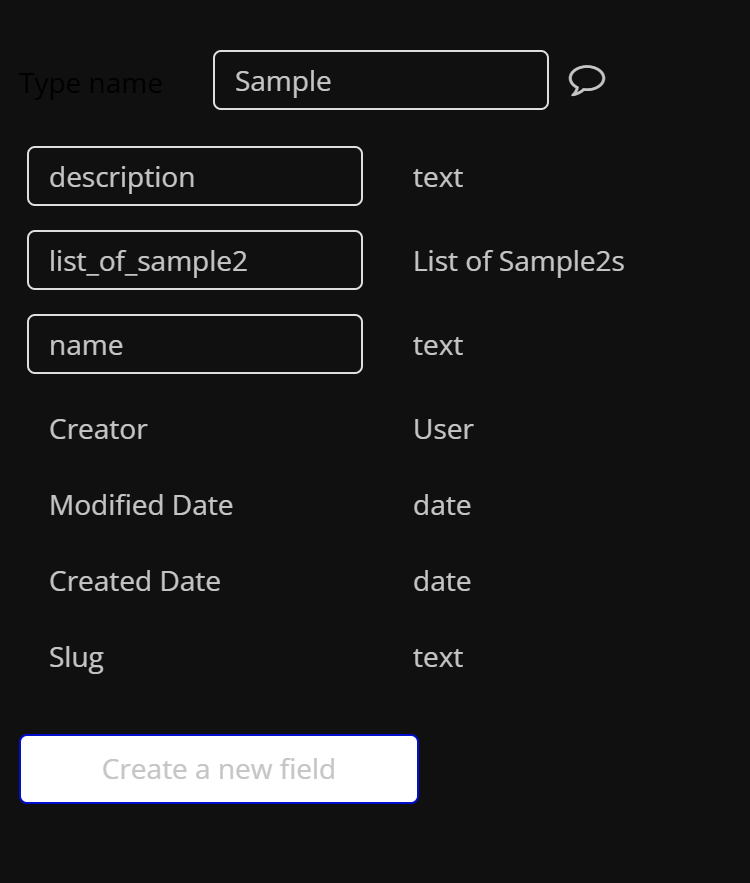
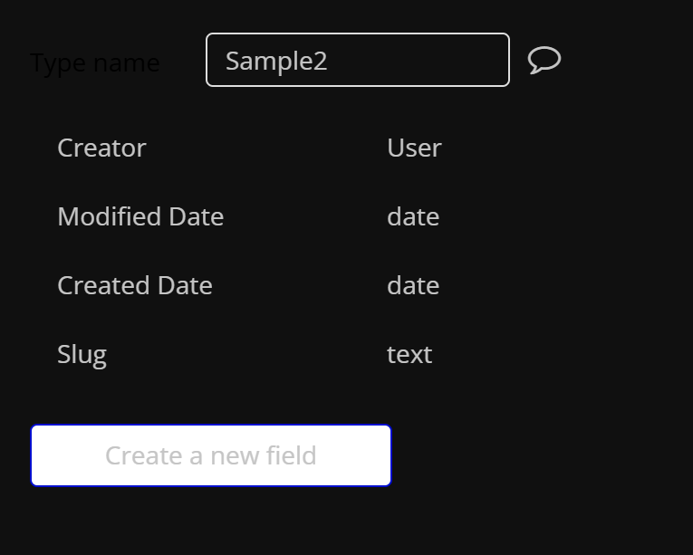

# fastapi-on-render

# setup:
python3 -m venv .venv

source .venv/bin/activate

pip install -r requirements.txt

# command to run: 
source .venv/bin/activate

uvicorn main:app --host 0.0.0.0

# sample datatypes

